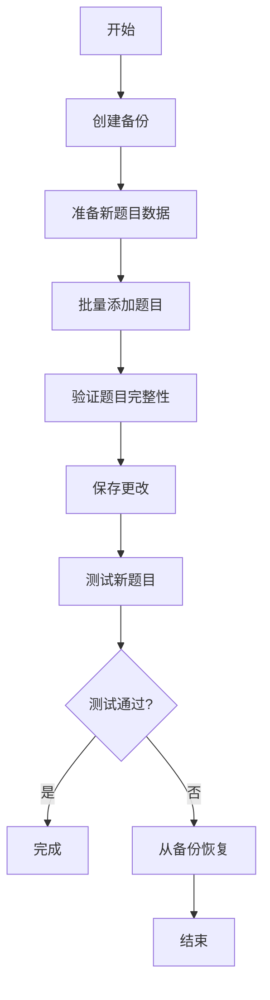

# CompeteMAS 题目库备份与扩展指南

## 📋 概述

本指南详细说明如何使用修改后的 `expand_problem_library.py` 工具，在安全备份原题库的基础上扩展 CompeteMAS 系统的题目库。

## 🔧 修改后的功能特性

### 1. **自动备份功能**
- 每次添加新题目前自动创建原题库备份
- 备份包含题目字典、配置文件和测试用例
- 时间戳命名，便于管理多个备份

### 2. **恢复功能**
- 支持从任意备份点恢复题库
- 完全恢复所有文件和数据
- 安全可靠，不会丢失数据

### 3. **交互式界面**
- 提供友好的命令行交互界面
- 支持多种操作：备份、添加、统计、恢复
- 实时显示操作进度和结果

## 🚀 使用方法

### 方法一：交互式使用

```bash
cd CompeteMAS
python expand_problem_library.py
```

然后按照菜单提示操作：

```
=== CompeteMAS 题目库扩展工具 ===
1. 创建备份
2. 从文件批量添加题目
3. 查看统计信息
4. 列出备份
5. 从备份恢复
6. 退出

请选择操作 (1-6):
```

### 方法二：编程方式使用

```python
from expand_problem_library import ProblemLibraryExpander

# 初始化扩展器
expander = ProblemLibraryExpander()

# 1. 创建备份
backup_name = expander.create_backup()

# 2. 添加新题目
expander.add_problems_from_file("new_problems.json", create_backup=False)

# 3. 保存更改
expander.save_changes()

# 4. 查看统计
stats = expander.get_statistics()
print(f"总题目数: {stats['total_problems']}")
```

### 方法三：使用示例脚本

```bash
cd CompeteMAS
python example_usage.py
```

## 📁 文件结构

```
CompeteMAS/
├── expand_problem_library.py      # 主要扩展工具
├── example_usage.py               # 使用示例
├── example_new_problems.json      # 示例题目数据
├── backups/                       # 备份目录
│   ├── problem_library_backup_20250101_120000/
│   │   ├── usaco_v2_dict.json
│   │   ├── all_problems.json
│   │   └── usaco_v3/tests/
│   └── problem_library_backup_20250101_130000/
└── data/datasets/                 # 当前题库
    ├── usaco_v2_dict.json
    └── usaco_v3/tests/
```

## 🔄 操作流程

### 1. **安全扩展流程**



### 2. **详细步骤**

#### 步骤 1: 创建备份
```python
backup_name = expander.create_backup()
print(f"备份创建成功: {backup_name}")
```

**备份内容：**
- `usaco_v2_dict.json` - 题目字典文件
- `all_problems.json` - 配置文件
- `usaco_v3/tests/` - 所有测试用例目录

#### 步骤 2: 准备新题目数据
```json
{
  "新题目ID": {
    "problem_data": {
      "name": "题目标题",
      "problem_level": "bronze/silver/gold/platinum",
      "description": "完整题目描述...",
      "input_format": "输入格式...",
      "output_format": "输出格式...",
      "samples": [...],
      "solution": "解答代码...",
      "runtime_limit": 2,
      "memory_limit": 256
    },
    "test_cases": [
      {"input": "输入1", "output": "输出1"},
      {"input": "输入2", "output": "输出2"}
    ]
  }
}
```

#### 步骤 3: 批量添加题目
```python
expander.add_problems_from_file("new_problems.json", create_backup=False)
expander.save_changes()
```

#### 步骤 4: 验证结果
```python
# 查看统计
stats = expander.get_statistics()
print(f"总题目数: {stats['total_problems']}")

# 验证新题目
expander.validate_problem("新题目ID")
```

## 🛡️ 安全特性

### 1. **自动备份**
- 每次操作前自动创建备份
- 时间戳命名，避免覆盖
- 完整备份所有相关文件

### 2. **冲突检测**
- 检测重复题目ID
- 警告覆盖操作
- 防止意外数据丢失

### 3. **恢复机制**
- 支持任意备份点恢复
- 完全恢复所有数据
- 操作简单安全

### 4. **验证功能**
- 验证题目数据完整性
- 检查测试用例配对
- 确保数据格式正确

## 📊 统计信息

工具提供详细的统计信息：

```python
stats = expander.get_statistics()
print("题目统计:")
print(f"  总计: {stats['total_problems']} 道题目")
print(f"  Bronze: {stats['by_level']['bronze']} 道")
print(f"  Silver: {stats['by_level']['silver']} 道")
print(f"  Gold: {stats['by_level']['gold']} 道")
print(f"  Platinum: {stats['by_level']['platinum']} 道")
```

## 🔧 高级功能

### 1. **备份管理**
```python
# 列出所有备份
backups = expander.list_backups()
for backup in backups:
    print(f"  {backup}")

# 从指定备份恢复
expander.restore_from_backup("problem_library_backup_20250101_120000")
```

### 2. **题目验证**
```python
# 验证单个题目
expander.validate_problem("题目ID")

# 验证所有题目
for problem_id in expander.problem_dict.keys():
    expander.validate_problem(problem_id)
```

### 3. **按难度筛选**
```python
# 列出指定难度的题目
bronze_problems = expander.list_problems_by_level("bronze")
silver_problems = expander.list_problems_by_level("silver")
```

## ⚠️ 注意事项

### 1. **备份重要性**
- 每次添加题目前必须创建备份
- 备份文件较大，注意磁盘空间
- 定期清理旧备份

### 2. **数据格式**
- 严格遵循原有JSON格式
- 确保所有必需字段完整
- 测试用例输入输出配对

### 3. **ID命名**
- 使用唯一题目ID
- 格式：`{编号}_{难度}_{题目名}`
- 避免与现有题目冲突

### 4. **测试验证**
- 添加题目后必须验证完整性
- 运行比赛测试新题目
- 确保系统正常工作

## 🆘 故障排除

### 1. **备份失败**
```bash
# 检查磁盘空间
df -h

# 检查权限
ls -la backups/
```

### 2. **题目添加失败**
```python
# 检查数据格式
import json
with open("new_problems.json", "r") as f:
    data = json.load(f)
print(json.dumps(data, indent=2))
```

### 3. **恢复失败**
```python
# 检查备份是否存在
backups = expander.list_backups()
print(f"可用备份: {backups}")

# 手动恢复
expander.restore_from_backup(backups[0])
```

## 📞 技术支持

如果遇到问题：

1. 检查错误日志
2. 验证数据格式
3. 使用备份恢复
4. 重新执行操作

通过这个工具，你可以安全、高效地扩展 CompeteMAS 系统的题目库，同时保证数据的安全性和完整性。 